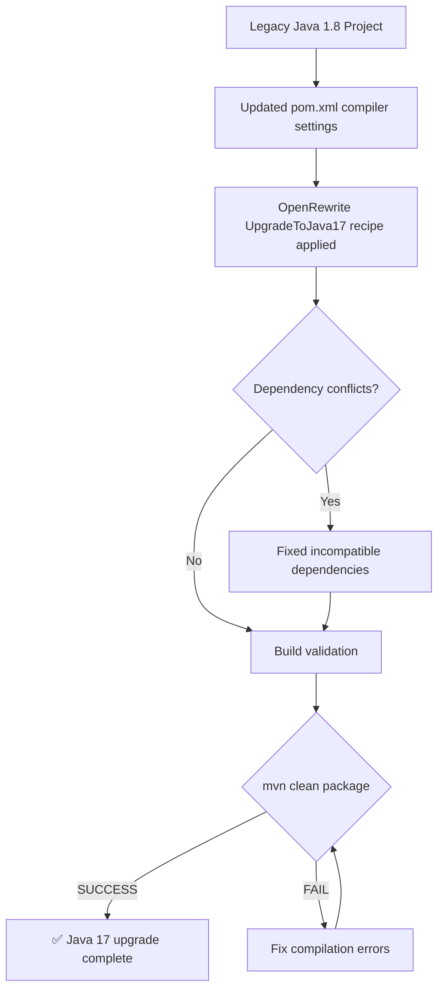

# Java Upgrade Skill

Use this skill to upgrade a legacy Java Maven project to a target Java version using OpenRewrite recipes — no premium package required.

## Step 1 — Confirm the project path and target version

Ask the user (or infer from context):
- Path to the Maven project root (the folder containing `pom.xml`)
- Target Java version (default: **17**)

## Step 2 — Read and update pom.xml

Use `read_file` to open `pom.xml`. Make the following changes using `apply_diff`:

1. Set `<java.version>17</java.version>` in `<properties>` (add if missing)
2. Set `<maven.compiler.source>17</maven.compiler.source>`
3. Set `<maven.compiler.target>17</maven.compiler.target>`
4. Add the OpenRewrite Maven plugin if not present:

```xml
<plugin>
  <groupId>org.openrewrite.maven</groupId>
  <artifactId>rewrite-maven-plugin</artifactId>
  <version>5.34.1</version>
  <configuration>
    <activeRecipes>
      <recipe>org.openrewrite.java.migrate.UpgradeToJava17</recipe>
    </activeRecipes>
  </configuration>
  <dependencies>
    <dependency>
      <groupId>org.openrewrite.recipe</groupId>
      <artifactId>rewrite-migrate-java</artifactId>
      <version>2.17.0</version>
    </dependency>
  </dependencies>
</plugin>
```

## Step 3 — Run OpenRewrite recipes

Use `execute_command` from the project root:

```sh
mvn rewrite:run -Drewrite.activeRecipes=org.openrewrite.java.migrate.UpgradeToJava17
```

Capture and review the output. If `mvn` is not available, instruct the user to install it (see Troubleshooting below).

## Step 4 — Fix dependency incompatibilities

After the recipe run, execute:

```sh
mvn dependency:tree 2>&1 | grep -i "conflict\|error\|WARN"
```

For each conflict found:
- Read the affected `pom.xml` section
- Apply the fix using `apply_diff` — update the version to a Java-17-compatible release
- Common fixes:
  - `javassist` → upgrade to `3.29.2-GA`
  - `asm` → upgrade to `9.6`
  - Any `javax.*` import → rewrite to `jakarta.*` equivalent

## Step 5 — Validate the build

Run:

```sh
mvn clean package -DskipTests
```

If the build fails:
- Read the error output carefully
- Fix the specific compilation errors using `apply_diff`
- Re-run until `BUILD SUCCESS`

## Step 6 — Generate audit flowchart

Once the build passes, generate a Mermaid diagram summarising all changes made. Write it to `java-upgrade-report.md` in the project root:

```markdown
# Java Upgrade Report

**Source version:** Java 1.8  
**Target version:** Java 17  
**Tool:** OpenRewrite `UpgradeToJava17` recipe  

## Changes Applied



## Summary of Changes
| File | Change |
|---|---|
| `pom.xml` | Java version → 17, added OpenRewrite plugin |
| _(list each file changed by recipes)_ | _(description of change)_ |
```

## Troubleshooting

**`mvn` not found:**
Switch to Agent mode and run: `brew install maven` (macOS) or `sudo apt install maven` (Ubuntu)

**SDKMAN not installed:**
Run: `curl -s "https://get.sdkman.io" | bash` then `sdk install java 17-tem`

**OpenRewrite recipe fails with network error:**
The recipe downloads dependencies from Maven Central. Ensure internet connectivity, then retry.

**`javax` imports still present after recipe:**
Manually search with `grep -r "import javax\." src/` and replace with `jakarta.` equivalents for any Jakarta EE APIs (servlet, persistence, validation).
